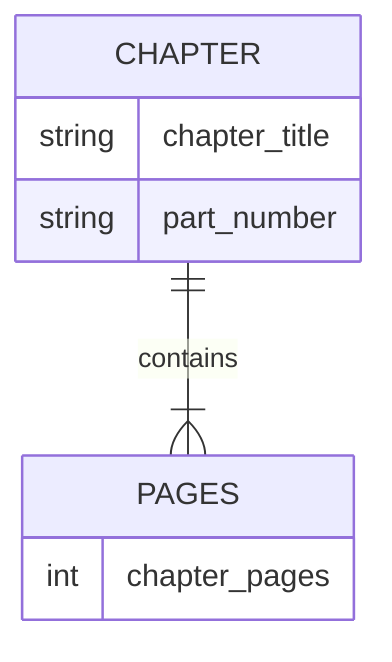

# The Child Under Eight
Arya Zarandazchi-Rahman

The Child Under Eight by Henrietta Brown Smith is a critique of public school education.

Render: https://sqc-project.onrender.com

```mermaid
erDiagram
    CHAPTER ||--|{ PAGES: contains
    CHAPTER {
        string chapter_title
        string part_number
        
    }
    PAGES
    PAGES {
        int chapter_pages
        
    }
```
