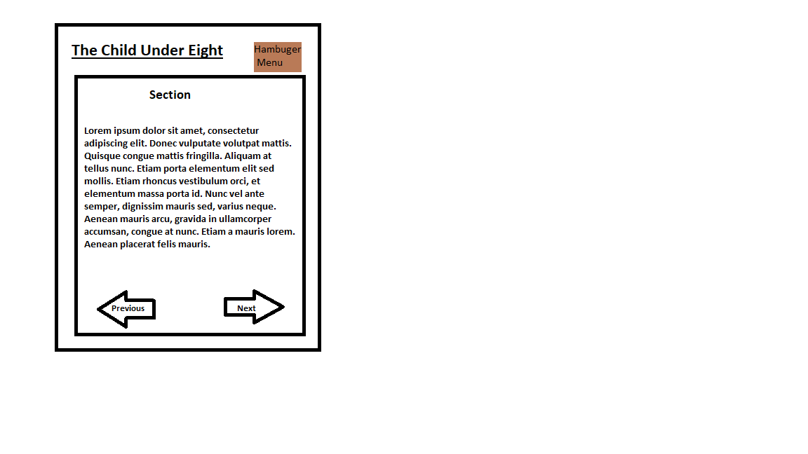

THE CHILD UNDER EIGHT
=====================

A summary of The Child Under Eight by E. R. Murray and Henrietta Brown Smith

Data Source
---------------------
[The Child Under Eight Ebook][Ebook]

[Ebook]: https://www.gutenberg.org/ebooks/10042

Items of Interest
---------------------
+ I. "WHAT'S IN A NAME?"
+ II. THE BIOLOGIST EDUCATOR
+ III. LEARNING BORN OF PLAY IV. FROM 1816 TO 1919
+ V. "THE WORLD'S MINE OYSTER"
+ VI. "ALL THE WORLD'S A STAGE"
+ VII. JOY IN MAKING VIII. STORIES
+ IX. IN GRASSY PLACES
+ X. A WAY TO GOD
+ XI. RHYTHM
+ XII. FROM FANCY TO FACT
+ XIII. NEW NEEDS AND NEW HELPS
+ XIV. CERTAIN CHARACTERISTICS OF GROWTH
+ XV. THE INFANT SCHOOL OF TO-DAY
+ XVI. SOME VITAL PRINCIPLES
+ XVII. THE NEED FOR EXPERIENCE
+ XVIII. GAINING EXPERIENCE BY PLAY
+ XIX. THE UNITY OF EXPERIENCE
+ XX. GAINING EXPERIENCE THROUGH FREEDOM
+ XXI. EXPERIENCES OF HUMAN CONDUCT.
+ XXII. EXPERIENCES OF THE NATURAL WORLD
+ XXIII. EXPERIENCES OF MATHEMATICAL TRUTHS
+ XXIV. EXPERIENCES BY MEANS OF DOING.
+ XXV. EXPERIENCES OF THE LIFE OF MAN
+ XXVI. EXPERIENCES RECORDED AND PASSED ON
+ XXVII. THE THINGS THAT REALLY MATTER.

Proposed Layout
---------------------

